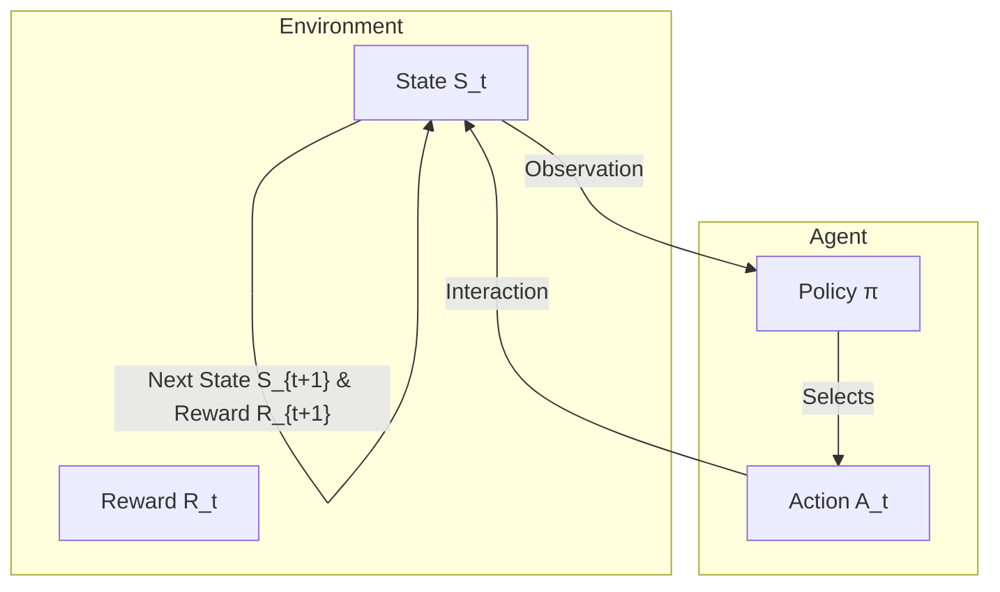

---

# 1.1.2 MDP 形式化定义 (Formal Definition of MDP)

---

## 1. 定义 (Definition)

马尔可夫决策过程 (Markov Decision Process, MDP) 是对序贯决策问题 (sequential decision making) 的经典形式化。它在马尔可夫过程的基础上，加入了决策者（智能体）的动作和与这些动作相关的奖励信号。

一个标准的、离散时间的 MDP 由一个五元组 $(\mathcal{S}, \mathcal{A}, P, R, \gamma)$ 定义 [1]：

1.  **状态空间 (State Space) $\mathcal{S}$**: 一个有限或可数无限的状态集合，代表了智能体可能观察到的所有环境快照。

2.  **动作空间 (Action Space) $\mathcal{A}$**: 一个有限或可数无限的动作集合，代表了智能体可以执行的所有决策。有时也用 $\mathcal{A}(s)$ 表示在状态 $s$ 下可执行的动作集合。

3.  **状态转移概率函数 (State Transition Probability Function) $P$**: 一个函数 $P: \mathcal{S} \times \mathcal{A} \times \mathcal{S} \to [0, 1]$，定义了环境的动态模型 (dynamics)。$P(s'|s, a)$ 表示在状态 $s$ 执行动作 $a$ 后，环境转移到下一状态 $s'$ 的概率：
    $$ 
    P(s'|s, a) = \mathbb{P}(S_{t+1} = s' | S_t = s, A_t = a) 
    $$ 
    该函数必须满足概率公理：
    $$ 
    \forall s \in \mathcal{S}, a \in \mathcal{A}(s), \quad \sum_{s' \in \mathcal{S}} P(s'|s, a) = 1 
    $$ 

4.  **奖励函数 (Reward Function) $R$**: 奖励函数定义了智能体的即时目标。它有几种常见的定义形式：
    -   作为状态、动作和下一状态的函数 $R: \mathcal{S} \times \mathcal{A} \times \mathcal{S} \to \mathbb{R}$，此时奖励 $R_{t+1} = R(S_t, A_t, S_{t+1})$。
    -   作为状态和动作的函数 $R: \mathcal{S} \times \mathcal{A} \to \mathbb{R}$，此时奖励 $R_{t+1} = R(S_t, A_t)$。这种形式可以通过对下一状态求期望来得到：$R(s, a) = \sum_{s' \in \mathcal{S}} P(s'|s, a) R(s, a, s')$。
    -   最简洁的形式是作为状态的函数 $R: \mathcal{S} \to \mathbb{R}$，此时 $R_{t+1} = R(S_{t+1})$。

5.  **折扣因子 (Discount Factor) $\gamma$**: 一个介于 $[0, 1]$ 之间的标量，用于权衡即时奖励和未来奖励的重要性。折扣因子体现了未来的不确定性或对即时回报的偏好。

## 2. 智能体-环境交互循环 (The Agent-Environment Interaction Loop)

MDP 描述了一个智能体与环境交互的循环过程，如下图所示：

交互流程如下：

1.  在时间步 $t$，智能体观察到环境的状态 $S_t \in \mathcal{S}$。
2.  基于状态 $S_t$，智能体根据其策略 $\pi$ 选择一个动作 $A_t \in \mathcal{A}(S_t)$。
3.  环境接收到动作 $A_t$，并根据其动态模型，转移到一个新的状态 $S_{t+1} \in \mathcal{S}$，同时向智能体返回一个标量奖励 $R_{t+1} \in \mathbb{R}$。
4.  时间步推进到 $t+1$，循环继续。

## 3. 策略与回报 (Policy and Return)

智能体的行为由其**策略 (Policy)** $\pi$ 定义。策略是一个从状态到选择每个可能动作的概率的映射。

> **定义：策略**
> 
> 一个策略 $\pi$ 是一个函数 $\pi: \mathcal{S} \times \mathcal{A} \to [0, 1]$，其中 $\pi(a|s)$ 是在状态 $s$ 时选择动作 $a$ 的概率：
> $$ 
> \pi(a|s) = \mathbb{P}(A_t = a | S_t = s) 
> $$ 
> 且满足 $\forall s \in \mathcal{S}, \sum_{a \in \mathcal{A}(s)} \pi(a|s) = 1$。

智能体的目标是最大化从当前时刻开始的**累积折扣回报 (Discounted Return)**，记为 $G_t$：

> **定义：回报**
> 
> $$ 
> G_t = R_{t+1} + \gamma R_{t+2} + \gamma^2 R_{t+3} + \dots = \sum_{k=0}^{\infty} \gamma^k R_{t+k+1} 
> $$ 

折扣因子 $\gamma$ 的作用是：
-   **数学收敛性**: 当 $\gamma < 1$ 且奖励有界时，保证了无限序列回报 $G_t$ 是一个有限值。
-   **模型不确定性**: 体现了对遥远未来的不确定性，未来的奖励价值会打折扣。
-   **经济学偏好**: 符合人类或经济系统对即时回报的偏好。

强化学习的最终目标，就是找到一个最优策略 $\pi^*$，使得在任意初始状态下，预期的累积回报最大化。

## 4. 参考文献 (References)

1.  Sutton, R. S., & Barto, A. G. (2018). *Reinforcement learning: An introduction*. MIT press. (Section 3.2, 3.3, 3.5)
2.  Puterman, M. L. (2014). *Markov decision processes: discrete stochastic dynamic programming*. John Wiley & Sons. (Chapter 2)
