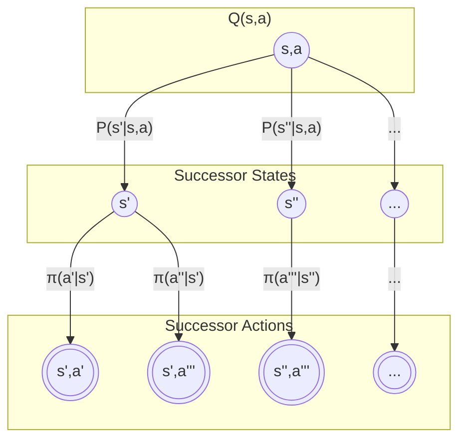

---

# 1.1.4.2 贝尔曼期望方程：动作值函数 (Bellman Expectation Equation: Action-Value Function)

---

## 1. 推导 (Derivation)

动作值函数 (Action-Value Function) $Q^\pi(s, a)$ 度量了在状态 $s$ 执行动作 $a$ 后，再继续遵循策略 $\pi$ 所能获得的期望回报。它对于比较在同一状态下不同动作的优劣至关重要。

> **定义：动作值函数**
> $$ 
> Q^\pi(s, a) \triangleq \mathbb{E}_\pi[G_t | S_t = s, A_t = a] = \mathbb{E}_\pi \left[ \sum_{k=0}^{\infty} \gamma^k R_{t+k+1} \Big| S_t = s, A_t = a \right] 
> $$

与状态值函数的推导类似，我们同样可以将回报 $G_t$ 分解为即时奖励 $R_{t+1}$ 和后续的折扣回报 $\gamma G_{t+1}$：
$$ 
Q^\pi(s, a) = \mathbb{E}_\pi [R_{t+1} + \gamma G_{t+1} | S_t = s, A_t = a] 
$$

利用期望的线性性质，我们将其分解为两部分：
$$ 
Q^\pi(s, a) = \mathbb{E}_\pi [R_{t+1} | S_t = s, A_t = a] + \mathbb{E}_\pi [\gamma G_{t+1} | S_t = s, A_t = a] 
$$

现在我们分别处理这两项：
1.  **第一项（期望即时奖励）**: 在状态 $s$ 执行动作 $a$ 后的期望奖励，根据定义就是 $R(s, a)$。
    $$ 
    \mathbb{E}_\pi [R_{t+1} | S_t = s, A_t = a] = R(s, a) 
    $$

2.  **第二项（期望未来回报）**: 这一项是后续回报的期望。我们可以利用全期望公式，通过对所有可能的下一状态 $s'$ 和下一动作 $a'$ 进行积分/求和来计算。
    $$ 
    \mathbb{E}_\pi [\gamma G_{t+1} | S_t = s, A_t = a] = \gamma \sum_{s' \in \mathcal{S}} P(s'|s, a) \sum_{a' \in \mathcal{A}} \pi(a'|s') \mathbb{E}_\pi[G_{t+1} | S_{t+1}=s', A_{t+1}=a'] 
    $$
    注意到 $\mathbb{E}_\pi[G_{t+1} | S_{t+1}=s', A_{t+1}=a']$ 正是 $Q^\pi(s', a')$ 的定义。因此，上式可以写为：
    $$ 
    = \gamma \sum_{s' \in \mathcal{S}} P(s'|s, a) \sum_{a' \in \mathcal{A}} \pi(a'|s') Q^\pi(s', a') 
    $$

将两部分合并，我们就得到了**动作值函数 $Q^\pi(s, a)$ 的贝尔曼期望方程**：

> **贝尔曼期望方程 (Q-function)**
> $$ 
> Q^\pi(s, a) = R(s, a) + \gamma \sum_{s' \in \mathcal{S}} P(s'|s, a) \sum_{a' \in \mathcal{A}} \pi(a'|s') Q^\pi(s', a') 
> $$

这个方程表明，一个状态-动作对的价值，等于执行该动作的期望即时奖励，加上所有可能的后继状态-动作对的折扣价值的期望。

## 2. V函数与Q函数的关系 (Relationship between V-function and Q-function)

状态值函数 $V^\pi(s)$ 和动作值函数 $Q^\pi(s, a)$ 之间存在着简单而重要的关系。

-   $V^\pi(s)$ 可以用 $Q^\pi(s, a)$ 来表示。一个状态的价值，是在该状态下遵循策略 $\pi$ 所能采取的所有动作的价值的期望：
    $$ 
    V^\pi(s) = \sum_{a \in \mathcal{A}} \pi(a|s) Q^\pi(s, a) 
    $$

-   $Q^\pi(s, a)$ 也可以用 $V^\pi(s)$ 来表示。一个状态-动作对的价值，是执行该动作后的期望即时奖励，加上所有可能的下一状态的折扣价值的期望：
    $$ 
    Q^\pi(s, a) = R(s, a) + \gamma \sum_{s' \in \mathcal{S}} P(s'|s, a) V^\pi(s') 
    $$

将这两个关系式相互代入，就可以在 $V^\pi$ 和 $Q^\pi$ 的贝尔曼期望方程之间进行转换。

## 3. 备份图 (Backup Diagram)

$Q^\pi(s, a)$ 的贝尔曼期望方程同样可以用备份图来直观表示。这个过程是从一个特定的状态-动作对 $(s, a)$ 开始，展望其所有可能的后继状态 $s'$，然后再从每个 $s'$ 展望其所有可能的后继动作 $a'$。

-   顶层空心圆圈代表状态-动作对 $(s, a)$。
-   从 $(s, a)$ 出发的边代表根据环境动态 $P$ 可能转移到的各个下一状态 $s'$。
-   第二层的实心圆圈代表后继状态。
-   从每个后继状态 $s'$ 出发的边代表根据策略 $\pi$ 可能选择的各个下一动作 $a'$。
-   $Q^\pi(s, a)$ 的计算需要两层期望：一层是对下一状态的期望，另一层是对下一动作的期望。

## 4. 参考文献 (References)

1.  Sutton, R. S., & Barto, A. G. (2018). *Reinforcement learning: An introduction*. MIT press. (Section 3.6)
2.  Puterman, M. L. (2014). *Markov decision processes: discrete stochastic dynamic programming*. John Wiley & Sons.
