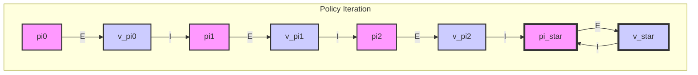

---

# 1.2.3.1 策略迭代算法流程 (Policy Iteration Algorithm)

---

## 1. 算法描述 (Algorithm Description)

策略迭代算法通过交替执行两个核心步骤——策略评估和策略改进——来寻找最优策略。这个过程从一个任意的初始策略 $\pi_0$ 开始，生成一个单调不减的值函数序列和一个最终收敛到最优的策略序列。

**算法的两个阶段:**

1.  **策略评估 (Policy Evaluation):** 在这个阶段，算法的目标是计算当前策略 $\pi_k$ 的状态值函数 $V^{\pi_k}$。这通常通过迭代应用贝尔曼期望方程来完成，直至值函数收敛到一个稳定值。这个内循环的更新规则是：
    $$ 
    V_{i+1}(s) \leftarrow \sum_{a \in \mathcal{A}} \pi_k(a|s) \left( R(s,a) + \gamma \sum_{s' \in \mathcal{S}} P(s'|s,a) V_i(s') \right) 
    $$
    其中 $i$ 是评估步骤的迭代次数。这个过程会一直持续到 $\max_{s \in \mathcal{S}} |V_{i+1}(s) - V_i(s)|$ 小于一个小的阈值 $\theta$。

2.  **策略改进 (Policy Improvement):** 在获得当前策略的值函数 $V^{\pi_k}$ 后，算法通过贪婪地选择动作来构建一个更好的新策略 $\pi_{k+1}$。对于每个状态 $s$，新的策略将选择使得期望回报最大化的动作：
    $$ 
    \pi_{k+1}(s) \leftarrow \arg\max_{a \in \mathcal{A}} Q^{\pi_k}(s, a) = \arg\max_{a \in \mathcal{A}} \left( R(s,a) + \gamma \sum_{s' \in \mathcal{S}} P(s'|s,a) V^{\pi_k}(s') \right) 
    $$

**终止条件:**

当策略改进步骤产生的新策略 $\pi_{k+1}$ 与旧策略 $\pi_k$ 相同时，说明策略已经无法再被改进。此时，算法终止，当前策略即为最优策略 $\pi^*$，其对应的值函数 $V^{\pi_k}$ 也等于最优值函数 $V^*$。

## 2. 伪代码 (Pseudocode)

以下是策略迭代算法的完整伪代码，清晰地展示了其两阶段的循环结构。

```
Algorithm: Policy Iteration

1. Initialization
   Initialize V(s) ∈ ℝ and π(s) ∈ A(s) arbitrarily for all s ∈ S

2. Policy Evaluation
   Loop:
     Δ ← 0
     Loop for each s in S:
       v ← V(s)
       V(s) ← Σ_a π(a|s) [ R(s,a) + γ Σ_s' P(s'|s,a) V(s') ]
       Δ ← max(Δ, |v - V(s)|)
   until Δ < θ (a small positive number)

3. Policy Improvement
   policy-stable ← true
   For each s in S:
     old-action ← π(s)
     π(s) ← argmax_a Σ_s' P(s'|s,a) [ R(s,a,s') + γV(s') ]
     If old-action ≠ π(s), then policy-stable ← false

   If policy-stable, then stop and return V and π; else go to 2
```

## 3. 图示 (Illustration)

策略迭代的过程可以被形象地描述为在一个由值函数和策略构成的二维空间中交替爬升，直至达到顶点（最优解）。



-   **E (Evaluation):** 箭头代表策略评估过程，即从当前策略 $\pi_k$ 计算出其值函数 $V^{\pi_k}$。
-   **I (Improvement):** 箭头代表策略改进过程，即从当前值函数 $V^{\pi_k}$ 贪婪地导出一个更好的策略 $\pi_{k+1}$。

这个过程不断迭代，策略和值函数交替提升，最终收敛于最优策略 $\pi^*$ 和最优值函数 $V^*$。

## 4. 参考文献 (References)

1.  Sutton, R. S., & Barto, A. G. (2018). *Reinforcement learning: An introduction*. MIT press. (Section 4.3)
2.  Howard, R. A. (1960). *Dynamic programming and Markov processes*. MIT press.
