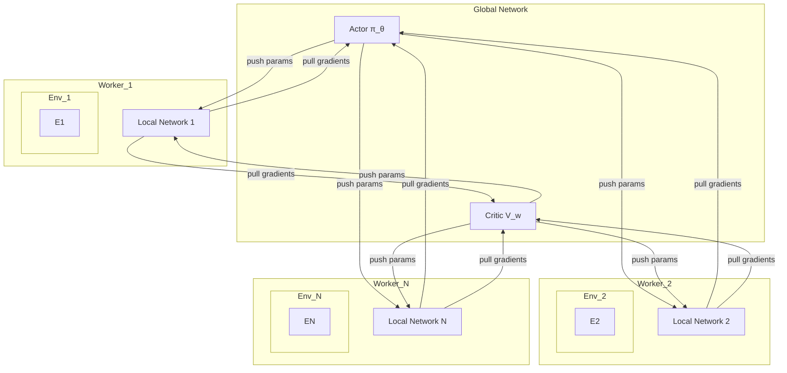

---

# 2.4.3 A3C: 异步优势 Actor-Critic (Asynchronous Advantage Actor-Critic)

---

## 1. 算法概述 (Algorithm Overview)

A3C (Asynchronous Advantage Actor-Critic) 是由 DeepMind 在2016年提出的一种具有里程碑意义的深度强化学习算法 [1]。它通过引入**异步 (asynchronous)** 训练框架，极大地提高了学习的稳定性和速度，并且不再需要经验回放 (Experience Replay) 机制。

在 DQN 等算法中，经验回放被用来打破数据样本之间的时间相关性，从而稳定训练。A3C 采用了另一种截然不同的思路来解决这个问题：**并行化**。

**核心思想:**

A3C 的核心思想是创建多个并行的智能体 (worker)，每个智能体都在一个独立的环境副本中与环境进行交互，并独立地计算梯度。这些 worker 共享一个全局的网络参数（一个全局的演员-评论家网络）。

每个 worker 在本地收集一定量的经验后，会计算出对全局网络参数的梯度更新量。然后，它会**异步地**将这个梯度应用到全局网络上，而不需要等待或与其他 worker 同步。更新完后，它又从全局网络拉取最新的参数，然后继续进行下一轮的交互。

由于每个 worker 都在探索环境的不同部分，它们所经历的轨迹是多样化的。当这些来自不同 worker 的、多样化的梯度异步地应用到全局网络时，样本之间的相关性就被自然地打破了。这就好像在任何一个时间点，全局网络都在接收来自不同“经验流”的更新，使得整体的更新方向更加平稳。

## 2. 算法架构 (Algorithm Architecture)

-   存在一个**全局网络**，包含演员和评论家的参数 $\theta$ 和 $w$。
-   存在多个 **worker 线程**，每个线程有自己的网络参数副本和独立的环境实例。
-   每个 worker 的循环如下：
    1.  **重置**: 从全局网络复制参数到本地网络。
    2.  **交互**: 在环境中执行 $t_{max}$ 步或直到片段结束，收集经验 $(s_t, a_t, r_t, s_{t+1})$。
    3.  **计算回报**: 计算 N-步回报。从最后一步 $t_{max}$ 开始，如果不是终止状态，则用本地网络的评论家自举 (bootstrap) $R = V_w(s_{t_{max}})$；否则 $R=0$。然后向前循环计算每一步的回报 $R_t = r_t + \gamma R_{t+1}$。
    4.  **计算梯度**: 累积对本地网络参数的梯度：
        -   **演员梯度**: $d\theta \leftarrow d\theta + \nabla_\theta \log \pi_\theta(a_t|s_t)(R_t - V_w(s_t))$
        -   **评论家梯度**: $dw \leftarrow dw + \partial (R_t - V_w(s_t))^2 / \partial w$
    5.  **异步更新**: 将计算出的梯度 $d\theta$ 和 $dw$ **异步地**应用到全局网络参数上。

## 3. 关键特性 (Key Features)

-   **异步更新**: 这是 A3C 的核心。它允许多个 worker 并行运行，无需等待彼此，从而提高了硬件（尤其是 CPU 多核）的利用率。
-   **无需经验回放**: 并行化的经验流天然地去相关，因此不再需要消耗大量内存的经验回放缓冲区。
-   **N-步回报**: A3C 使用 N-步回报来计算优势函数，这在偏差和方差之间提供了一个比单步 TD 更好的平衡。
-   **熵正则化**: A3C 在其目标函数中明确地加入了一个熵项，以鼓励策略的探索性，避免其过早地收敛到次优的确定性策略。
    $$ 
    \nabla_\theta \log \pi_\theta(a_t|s_t)A(s_t, a_t) + \beta \nabla_\theta H(\pi_\theta(s_t)) 
    $$
    其中 $H$ 是熵，$\beta$ 是控制熵正则化强度的超参数。

## 4. 影响与局限性 (Impact and Limitations)

**影响:**

A3C 的提出在当时是一个巨大的突破。它展示了一种全新的、不依赖经验回放的稳定 DRL 训练方法，并且其出色的性能和高效率使其在各种任务（从 Atari 游戏到连续控制）上都取得了 SOTA 的结果。它启发了后续大量的并行强化学习算法。

**局限性:**

-   **对 GPU 利用不充分**: A3C 的每个 worker 通常很轻量，并且梯度计算和网络前向传播的批量大小 (batch size) 很小。这使得它在现代 GPU 上的并行计算优势无法充分发挥。
-   **梯度冲突**: 异步更新可能导致一个 worker 使用“陈旧”的策略计算出的梯度覆盖掉另一个 worker 刚刚应用的新更新，造成一定的学习效率损失。

由于这些原因，A3C 的同步版本 **A2C (Advantage Actor-Critic)** 在实践中往往更受欢迎，因为它能更好地利用 GPU 并实现更稳定的学习。

## 5. 参考文献 (References)

1.  Mnih, V., Badia, A. P., Mirza, M., Graves, A., Lillicrap, T., Harley, T., ... & Kavukcuoglu, K. (2016, June). Asynchronous methods for deep reinforcement learning. In *International conference on machine learning* (pp. 1928-1937).
