# Agentic Reinforcement Learning: A Comprehensive Knowledge Map

**Version:** 1.0

**Authors:** Damon Li

---

## 1. Introduction

This repository provides a comprehensive and mathematically rigorous knowledge map for the field of Agentic Reinforcement Learning (RL). It is designed for researchers and practitioners with a strong mathematical background, particularly those at the PhD level in mathematics, statistics, or related disciplines. The content spans from the foundational principles of Markov Decision Processes to the cutting-edge frontiers of multi-agent, meta, and model-based RL.

Our primary objective is to present the core concepts of RL not merely as algorithmic recipes, but as a formal mathematical framework. Each topic is meticulously detailed with:

- **Formal Definitions and Proofs:** Key concepts are introduced using the precise language of set theory, probability, and optimization. Theorems are stated and proven rigorously.
- **Algorithmic and Complexity Analysis:** Algorithms are presented with detailed pseudocode, alongside analyses of their computational complexity, convergence properties, and numerical stability.
- **Scholarly Citations:** All claims and algorithms are grounded in seminal papers from top-tier conferences (e.g., NeurIPS, ICML, ICLR) and classic textbooks, with references provided in BibTeX format.
- **Structural Organization:** The knowledge is organized hierarchically, from foundational theory to advanced applications, to facilitate structured learning and quick reference.

This knowledge map is intended to be a living document, continuously updated to reflect the latest advancements in the rapidly evolving field of Agentic RL.

## 2. Knowledge Map Overview (Mindmap)

The following mindmap illustrates the high-level structure of this knowledge repository, showing the main pillars and their interconnections.

```mermaid
graph TD
    A[Agentic RL Knowledge Map] --> B[01. Foundations];
    A --> C[02. Classical RL Algorithms];
    A --> D[03. Deep Reinforcement Learning];
    A --> E[04. Multi-Agent RL];
    A --> F[05. Advanced Topics];
    A --> G[06. Applications];

    subgraph 01. Foundations
        B1[MDP & Markov Processes];
        B2[Dynamic Programming];
        B3[Monte Carlo Methods];
        B4[Temporal-Difference Learning];
        B5[Function Approximation];
    end

    subgraph 02. Classical RL Algorithms
        C1[Value & Policy Iteration];
        C2[Q-Learning];
        C3[SARSA];
        C4[Actor-Critic];
        C5[Eligibility Traces];
    end

    subgraph 03. Deep Reinforcement Learning
        D1[DQN Family];
        D2[Policy Gradient Methods];
        D3[Deterministic Policy Gradient];
        D4[Distributed RL];
    end

    subgraph 04. Multi-Agent RL
        E1[Game Theory Foundations];
        E2[Cooperative Learning];
        E3[Competitive Learning];
        E4[Communication Mechanisms];
    end

    subgraph 05. Advanced Topics
        F1[Model-Based RL];
        F2[Meta-RL];
        F3[Offline RL];
        F4[Online & Adaptive RL];
        F5[Hierarchical RL];
        F6[Inverse RL];
        F7[Safe RL];
    end

    subgraph 06. Applications
        G1[Robotics Control];
        G2[Game AI];
        G3[Autonomous Driving];
    end

    B --> B1 & B2 & B3 & B4 & B5;
    C --> C1 & C2 & C3 & C4 & C5;
    D --> D1 & D2 & D3 & D4;
    E --> E1 & E2 & E3 & E4;
    F --> F1 & F2 & F3 & F4 & F5 & F6 & F7;
    G --> G1 & G2 & G3;
```

## 3. Table of Contents

This table provides a complete, navigable index of the entire knowledge base. Each link points to a detailed `README.md` file for the corresponding topic.

- [01-基础理论](https://github.com/DemonDamon/agentic-rl-knowledge-map/tree/master/01-基础理论)
    - [01-MDP与马尔可夫过程](https://github.com/DemonDamon/agentic-rl-knowledge-map/tree/master/01-基础理论/01-MDP与马尔可夫过程)
        - [01-马尔可夫性质](https://github.com/DemonDamon/agentic-rl-knowledge-map/tree/master/01-基础理论/01-MDP与马尔可夫过程/01-马尔可夫性质)
        - [02-MDP形式化定义](https://github.com/DemonDamon/agentic-rl-knowledge-map/tree/master/01-基础理论/01-MDP与马尔可夫过程/02-MDP形式化定义)
        - [03-状态转移与奖励](https://github.com/DemonDamon/agentic-rl-knowledge-map/tree/master/01-基础理论/01-MDP与马尔可夫过程/03-状态转移与奖励)
        - [04-贝尔曼方程](https://github.com/DemonDamon/agentic-rl-knowledge-map/tree/master/01-基础理论/01-MDP与马尔可夫过程/04-贝尔曼方程)
            - [01-状态值函数](https://github.com/DemonDamon/agentic-rl-knowledge-map/tree/master/01-基础理论/01-MDP与马尔可夫过程/04-贝尔曼方程/01-状态值函数)
            - [02-动作值函数](https://github.com/DemonDamon/agentic-rl-knowledge-map/tree/master/01-基础理论/01-MDP与马尔可夫过程/04-贝尔曼方程/02-动作值函数)
            - [03-最优性方程](https://github.com/DemonDamon/agentic-rl-knowledge-map/tree/master/01-基础理论/01-MDP与马尔可夫过程/04-贝尔曼方程/03-最优性方程)
            - [04-收缩映射定理](https://github.com/DemonDamon/agentic-rl-knowledge-map/tree/master/01-基础理论/01-MDP与马尔可夫过程/04-贝尔曼方程/04-收缩映射定理)
    - [02-动态规划](https://github.com/DemonDamon/agentic-rl-knowledge-map/tree/master/01-基础理论/02-动态规划)
        - [01-策略评估](https://github.com/DemonDamon/agentic-rl-knowledge-map/tree/master/01-基础理论/02-动态规划/01-策略评估)
        - [02-策略改进](https://github.com/DemonDamon/agentic-rl-knowledge-map/tree/master/01-基础理论/02-动态规划/02-策略改进)
        - [03-策略迭代](https://github.com/DemonDamon/agentic-rl-knowledge-map/tree/master/01-基础理论/02-动态规划/03-策略迭代)
            - [01-算法流程](https://github.com/DemonDamon/agentic-rl-knowledge-map/tree/master/01-基础理论/02-动态规划/03-策略迭代/01-算法流程)
            - [02-收敛性证明](https://github.com/DemonDamon/agentic-rl-knowledge-map/tree/master/01-基础理论/02-动态规划/03-策略迭代/02-收敛性证明)
            - [03-复杂度分析](https://github.com/DemonDamon/agentic-rl-knowledge-map/tree/master/01-基础理论/02-动态规划/03-策略迭代/03-复杂度分析)
        - [04-值迭代](https://github.com/DemonDamon/agentic-rl-knowledge-map/tree/master/01-基础理论/02-动态规划/04-值迭代)
            - [01-算法流程](https://github.com/DemonDamon/agentic-rl-knowledge-map/tree/master/01-基础理论/02-动态规划/04-值迭代/01-算法流程)
            - [02-收敛性证明](https://github.com/DemonDamon/agentic-rl-knowledge-map/tree/master/01-基础理论/02-动态规划/04-值迭代/02-收敛性证明)
            - [03-与策略迭代的比较](https://github.com/DemonDamon/agentic-rl-knowledge-map/tree/master/01-基础理论/02-动态规划/04-值迭代/03-与策略迭代的比较)
    - [03-蒙特卡罗方法](https://github.com/DemonDamon/agentic-rl-knowledge-map/tree/master/01-基础理论/03-蒙特卡罗方法)
        - [01-首次访问MC](https://github.com/DemonDamon/agentic-rl-knowledge-map/tree/master/01-基础理论/03-蒙特卡罗方法/01-首次访问MC)
        - [02-每次访问MC](https://github.com/DemonDamon/agentic-rl-knowledge-map/tree/master/01-基础理论/03-蒙特卡罗方法/02-每次访问MC)
        - [03-探索与利用](https://github.com/DemonDamon/agentic-rl-knowledge-map/tree/master/01-基础理论/03-蒙特卡罗方法/03-探索与利用)
            - [01-ε-贪婪策略](https://github.com/DemonDamon/agentic-rl-knowledge-map/tree/master/01-基础理论/03-蒙特卡罗方法/03-探索与利用/01-ε-贪婪策略)
            - [02-探索起始](https://github.com/DemonDamon/agentic-rl-knowledge-map/tree/master/01-基础理论/03-蒙特卡罗方法/03-探索与利用/02-探索起始)
        - [04-重要性采样](https://github.com/DemonDamon/agentic-rl-knowledge-map/tree/master/01-基础理论/03-蒙特卡罗方法/04-重要性采样)
            - [01-普通重要性采样](https://github.com/DemonDamon/agentic-rl-knowledge-map/tree/master/01-基础理论/03-蒙特卡罗方法/04-重要性采样/01-普通重要性采样)
            - [02-加权重要性采样](https://github.com/DemonDamon/agentic-rl-knowledge-map/tree/master/01-基础理论/03-蒙特卡罗方法/04-重要性采样/02-加权重要性采样)
    - [04-时间差分学习](https://github.com/DemonDamon/agentic-rl-knowledge-map/tree/master/01-基础理论/04-时间差分学习)
        - [01-TD预测](https://github.com/DemonDamon/agentic-rl-knowledge-map/tree/master/01-基础理论/04-时间差分学习/01-TD预测)
            - [01-TD(0)算法](https://github.com/DemonDamon/agentic-rl-knowledge-map/tree/master/01-基础理论/04-时间差分学习/01-TD预测/01-TD(0)算法)
            - [02-TD(λ)算法](https://github.com/DemonDamon/agentic-rl-knowledge-map/tree/master/01-基础理论/04-时间差分学习/01-TD预测/02-TD(λ)算法)
        - [02-SARSA](https://github.com/DemonDamon/agentic-rl-knowledge-map/tree/master/01-基础理论/04-时间差分学习/02-SARSA)
            - [01-在策略学习](https://github.com/DemonDamon/agentic-rl-knowledge-map/tree/master/01-基础理论/04-时间差分学习/02-SARSA/01-在策略学习)
            - [02-收敛性分析](https://github.com/DemonDamon/agentic-rl-knowledge-map/tree/master/01-基础理论/04-时间差分学习/02-SARSA/02-收敛性分析)
            - [03-SARSA(λ)](https://github.com/DemonDamon/agentic-rl-knowledge-map/tree/master/01-基础理论/04-时间差分学习/02-SARSA/03-SARSA(λ))
        - [03-Q-Learning](https://github.com/DemonDamon/agentic-rl-knowledge-map/tree/master/01-基础理论/04-时间差分学习/03-Q-Learning)
            - [01-离策略学习](https://github.com/DemonDamon/agentic-rl-knowledge-map/tree/master/01-基础理论/04-时间差分学习/03-Q-Learning/01-离策略学习)
            - [02-最优性证明](https://github.com/DemonDamon/agentic-rl-knowledge-map/tree/master/01-基础理论/04-时间差分学习/03-Q-Learning/02-最优性证明)
            - [03-收敛条件](https://github.com/DemonDamon/agentic-rl-knowledge-map/tree/master/01-基础理论/04-时间差分学习/03-Q-Learning/03-收敛条件)
        - [04-期望SARSA](https://github.com/DemonDamon/agentic-rl-knowledge-map/tree/master/01-基础理论/04-时间差分学习/04-期望SARSA)
    - [05-函数逼近](https://github.com/DemonDamon/agentic-rl-knowledge-map/tree/master/01-基础理论/05-函数逼近)
        - [01-线性函数逼近](https://github.com/DemonDamon/agentic-rl-knowledge-map/tree/master/01-基础理论/05-函数逼近/01-线性函数逼近)
            - [01-特征构造](https://github.com/DemonDamon/agentic-rl-knowledge-map/tree/master/01-基础理论/05-函数逼近/01-线性函数逼近/01-特征构造)
            - [02-梯度下降](https://github.com/DemonDamon/agentic-rl-knowledge-map/tree/master/01-基础理论/05-函数逼近/01-线性函数逼近/02-梯度下降)
        - [02-非线性函数逼近](https://github.com/DemonDamon/agentic-rl-knowledge-map/tree/master/01-基础理论/05-函数逼近/02-非线性函数逼近)
        - [03-致命三元组](https://github.com/DemonDamon/agentic-rl-knowledge-map/tree/master/01-基础理论/05-函数逼近/03-致命三元组)
        - [04-经验回放](https://github.com/DemonDamon/agentic-rl-knowledge-map/tree/master/01-基础理论/05-函数逼近/04-经验回放)
- [02-经典强化学习算法](https://github.com/DemonDamon/agentic-rl-knowledge-map/tree/master/02-经典强化学习算法)
    - [01-值迭代与策略迭代](https://github.com/DemonDamon/agentic-rl-knowledge-map/tree/master/02-经典强化学习算法/01-值迭代与策略迭代)
        - [01-同步值迭代](https://github.com/DemonDamon/agentic-rl-knowledge-map/tree/master/02-经典强化学习算法/01-值迭代与策略迭代/01-同步值迭代)
        - [02-异步值迭代](https://github.com/DemonDamon/agentic-rl-knowledge-map/tree/master/02-经典强化学习算法/01-值迭代与策略迭代/02-异步值迭代)
        - [03-修正策略迭代](https://github.com/DemonDamon/agentic-rl-knowledge-map/tree/master/02-经典强化学习算法/01-值迭代与策略迭代/03-修正策略迭代)
    - [02-Q-Learning及其变体](https://github.com/DemonDamon/agentic-rl-knowledge-map/tree/master/02-经典强化学习算法/02-Q-Learning及其变体)
        - [01-表格Q-Learning](https://github.com/DemonDamon/agentic-rl-knowledge-map/tree/master/02-经典强化学习算法/02-Q-Learning及其变体/01-表格Q-Learning)
        - [02-Double-Q-Learning](https://github.com/DemonDamon/agentic-rl-knowledge-map/tree/master/02-经典强化学习算法/02-Q-Learning及其变体/02-Double-Q-Learning)
        - [03-Speedy-Q-Learning](https://github.com/DemonDamon/agentic-rl-knowledge-map/tree/master/02-经典强化学习算法/02-Q-Learning及其变体/03-Speedy-Q-Learning)
    - [03-SARSA及其变体](https://github.com/DemonDamon/agentic-rl-knowledge-map/tree/master/02-经典强化学习算法/03-SARSA及其变体)
        - [01-SARSA(0)](https://github.com/DemonDamon/agentic-rl-knowledge-map/tree/master/02-经典强化学习算法/03-SARSA及其变体/01-SARSA(0))
        - [02-SARSA(λ)](https://github.com/DemonDamon/agentic-rl-knowledge-map/tree/master/02-经典强化学习算法/03-SARSA及其变体/02-SARSA(λ))
        - [03-True-Online-SARSA](https://github.com/DemonDamon/agentic-rl-knowledge-map/tree/master/02-经典强化学习算法/03-SARSA及其变体/03-True-Online-SARSA)
    - [04-Actor-Critic方法](https://github.com/DemonDamon/agentic-rl-knowledge-map/tree/master/02-经典强化学习算法/04-Actor-Critic方法)
        - [01-基础AC架构](https://github.com/DemonDamon/agentic-rl-knowledge-map/tree/master/02-经典强化学习算法/04-Actor-Critic方法/01-基础AC架构)
        - [02-优势Actor-Critic](https://github.com/DemonDamon/agentic-rl-knowledge-map/tree/master/02-经典强化学习算法/04-Actor-Critic方法/02-优势Actor-Critic)
        - [03-自然梯度AC](https://github.com/DemonDamon/agentic-rl-knowledge-map/tree/master/02-经典强化学习算法/04-Actor-Critic方法/03-自然梯度AC)
    - [05-资格迹](https://github.com/DemonDamon/agentic-rl-knowledge-map/tree/master/02-经典强化学习算法/05-资格迹)
        - [01-累积迹](https://github.com/DemonDamon/agentic-rl-knowledge-map/tree/master/02-经典强化学习算法/05-资格迹/01-累积迹)
        - [02-替换迹](https://github.com/DemonDamon/agentic-rl-knowledge-map/tree/master/02-经典强化学习算法/05-资格迹/02-替换迹)
        - [03-Dutch迹](https://github.com/DemonDamon/agentic-rl-knowledge-map/tree/master/02-经典强化学习算法/05-资格迹/03-Dutch迹)
- [03-深度强化学习](https://github.com/DemonDamon/agentic-rl-knowledge-map/tree/master/03-深度强化学习)
    - [01-DQN系列](https://github.com/DemonDamon/agentic-rl-knowledge-map/tree/master/03-深度强化学习/01-DQN系列)
        - [01-DQN](https://github.com/DemonDamon/agentic-rl-knowledge-map/tree/master/03-深度强化学习/01-DQN系列/01-DQN)
            - [01-网络架构](https://github.com/DemonDamon/agentic-rl-knowledge-map/tree/master/03-深度强化学习/01-DQN系列/01-DQN/01-网络架构)
            - [02-经验回放](https://github.com/DemonDamon/agentic-rl-knowledge-map/tree/master/03-深度强化学习/01-DQN系列/01-DQN/02-经验回放)
            - [03-目标网络](https://github.com/DemonDamon/agentic-rl-knowledge-map/tree/master/03-深度强化学习/01-DQN系列/01-DQN/03-目标网络)
            - [04-损失函数](https://github.com/DemonDamon/agentic-rl-knowledge-map/tree/master/03-深度强化学习/01-DQN系列/01-DQN/04-损失函数)
        - [02-Double-DQN](https://github.com/DemonDamon/agentic-rl-knowledge-map/tree/master/03-深度强化学习/01-DQN系列/02-Double-DQN)
            - [01-过估计问题](https://github.com/DemonDamon/agentic-rl-knowledge-map/tree/master/03-深度强化学习/01-DQN系列/02-Double-DQN/01-过估计问题)
            - [02-动作选择与评估解耦](https://github.com/DemonDamon/agentic-rl-knowledge-map/tree/master/03-深度强化学习/01-DQN系列/02-Double-DQN/02-动作选择与评估解耦)
            - [03-收敛性分析](https://github.com/DemonDamon/agentic-rl-knowledge-map/tree/master/03-深度强化学习/01-DQN系列/02-Double-DQN/03-收敛性分析)
        - [03-Dueling-DQN](https://github.com/DemonDamon/agentic-rl-knowledge-map/tree/master/03-深度强化学习/01-DQN系列/03-Dueling-DQN)
            - [01-值函数分解](https://github.com/DemonDamon/agentic-rl-knowledge-map/tree/master/03-深度强化学习/01-DQN系列/03-Dueling-DQN/01-值函数分解)
            - [02-优势函数估计](https://github.com/DemonDamon/agentic-rl-knowledge-map/tree/master/03-深度强化学习/01-DQN系列/03-Dueling-DQN/02-优势函数估计)
            - [03-聚合层设计](https://github.com/DemonDamon/agentic-rl-knowledge-map/tree/master/03-深度强化学习/01-DQN系列/03-Dueling-DQN/03-聚合层设计)
        - [04-Rainbow](https://github.com/DemonDamon/agentic-rl-knowledge-map/tree/master/03-深度强化学习/01-DQN系列/04-Rainbow)
            - [01-组件集成](https://github.com/DemonDamon/agentic-rl-knowledge-map/tree/master/03-深度强化学习/01-DQN系列/04-Rainbow/01-组件集成)
            - [02-分布式RL](https://github.com/DemonDamon/agentic-rl-knowledge-map/tree/master/03-深度强化学习/01-DQN系列/04-Rainbow/02-分布式RL)
            - [03-Noisy-Nets](https://github.com/DemonDamon/agentic-rl-knowledge-map/tree/master/03-深度强化学习/01-DQN系列/04-Rainbow/03-Noisy-Nets)
            - [04-多步学习](https://github.com/DemonDamon/agentic-rl-knowledge-map/tree/master/03-深度强化学习/01-DQN系列/04-Rainbow/04-多步学习)
        - [05-其他变体](https://github.com/DemonDamon/agentic-rl-knowledge-map/tree/master/03-深度强化学习/01-DQN系列/05-其他变体)
            - [01-Categorical-DQN](https://github.com/DemonDamon/agentic-rl-knowledge-map/tree/master/03-深度强化学习/01-DQN系列/05-其他变体/01-Categorical-DQN)
            - [02-QR-DQN](https://github.com/DemonDamon/agentic-rl-knowledge-map/tree/master/03-深度强化学习/01-DQN系列/05-其他变体/02-QR-DQN)
    - [02-策略梯度方法](https://github.com/DemonDamon/agentic-rl-knowledge-map/tree/master/03-深度强化学习/02-策略梯度方法)
        - [01-REINFORCE](https://github.com/DemonDamon/agentic-rl-knowledge-map/tree/master/03-深度强化学习/02-策略梯度方法/01-REINFORCE)
            - [01-策略梯度定理](https://github.com/DemonDamon/agentic-rl-knowledge-map/tree/master/03-深度强化学习/02-策略梯度方法/01-REINFORCE/01-策略梯度定理)
            - [02-基线函数](https://github.com/DemonDamon/agentic-rl-knowledge-map/tree/master/03-深度强化学习/02-策略梯度方法/01-REINFORCE/02-基线函数)
            - [03-蒙特卡罗采样](https://github.com/DemonDamon/agentic-rl-knowledge-map/tree/master/03-深度强化学习/02-策略梯度方法/01-REINFORCE/03-蒙特卡罗采样)
        - [02-Actor-Critic](https://github.com/DemonDamon/agentic-rl-knowledge-map/tree/master/03-深度强化学习/02-策略梯度方法/02-Actor-Critic)
            - [01-优势函数](https://github.com/DemonDamon/agentic-rl-knowledge-map/tree/master/03-深度强化学习/02-策略梯度方法/02-Actor-Critic/01-优势函数)
            - [02-GAE](https://github.com/DemonDamon/agentic-rl-knowledge-map/tree/master/03-深度强化学习/02-策略梯度方法/02-Actor-Critic/02-GAE)
            - [03-A2C与A3C](https://github.com/DemonDamon/agentic-rl-knowledge-map/tree/master/03-深度强化学习/02-策略梯度方法/02-Actor-Critic/03-A2C与A3C)
        - [03-TRPO](https://github.com/DemonDamon/agentic-rl-knowledge-map/tree/master/03-深度强化学习/02-策略梯度方法/03-TRPO)
            - [01-信赖域优化](https://github.com/DemonDamon/agentic-rl-knowledge-map/tree/master/03-深度强化学习/02-策略梯度方法/03-TRPO/01-信赖域优化)
            - [02-单调性改进定理](https://github.com/DemonDamon/agentic-rl-knowledge-map/tree/master/03-深度强化学习/02-策略梯度方法/03-TRPO/02-单调性改进定理)
            - [03-Fisher信息矩阵](https://github.com/DemonDamon/agentic-rl-knowledge-map/tree/master/03-深度强化学习/02-策略梯度方法/03-TRPO/03-Fisher信息矩阵)
        - [04-PPO](https://github.com/DemonDamon/agentic-rl-knowledge-map/tree/master/03-深度强化学习/02-策略梯度方法/04-PPO)
            - [01-裁剪目标函数](https://github.com/DemonDamon/agentic-rl-knowledge-map/tree/master/03-深度强化学习/02-策略梯度方法/04-PPO/01-裁剪目标函数)
            - [02-值函数损失](https://github.com/DemonDamon/agentic-rl-knowledge-map/tree/master/03-深度强化学习/02-策略梯度方法/04-PPO/02-值函数损失)
            - [03-熵正则化](https://github.com/DemonDamon/agentic-rl-knowledge-map/tree/master/03-深度强化学习/02-策略梯度方法/04-PPO/03-熵正则化)
            - [04-优势估计](https://github.com/DemonDamon/agentic-rl-knowledge-map/tree/master/03-深度强化学习/02-策略梯度方法/04-PPO/04-优势估计)
    - [03-确定性策略梯度](https://github.com/DemonDamon/agentic-rl-knowledge-map/tree/master/03-深度强化学习/03-确定性策略梯度)
        - [01-DPG定理](https://github.com/DemonDamon/agentic-rl-knowledge-map/tree/master/03-深度强化学习/03-确定性策略梯度/01-DPG定理)
        - [02-DDPG](https://github.com/DemonDamon/agentic-rl-knowledge-map/tree/master/03-深度强化学习/03-确定性策略梯度/02-DDPG)
            - [01-Actor-Critic架构](https://github.com/DemonDamon/agentic-rl-knowledge-map/tree/master/03-深度强化学习/03-确定性策略梯度/02-DDPG/01-Actor-Critic架构)
            - [02-目标网络](https://github.com/DemonDamon/agentic-rl-knowledge-map/tree/master/03-深度强化学习/03-确定性策略梯度/02-DDPG/02-目标网络)
            - [03-OU噪声](https://github.com/DemonDamon/agentic-rl-knowledge-map/tree/master/03-深度强化学习/03-确定性策略梯度/02-DDPG/03-OU噪声)
            - [04-批归一化](https://github.com/DemonDamon/agentic-rl-knowledge-map/tree/master/03-深度强化学习/03-确定性策略梯度/02-DDPG/04-批归一化)
        - [03-TD3](https://github.com/DemonDamon/agentic-rl-knowledge-map/tree/master/03-深度强化学习/03-确定性策略梯度/03-TD3)
            - [01-双Q网络](https://github.com/DemonDamon/agentic-rl-knowledge-map/tree/master/03-深度强化学习/03-确定性策略梯度/03-TD3/01-双Q网络)
            - [02-目标策略平滑](https://github.com/DemonDamon/agentic-rl-knowledge-map/tree/master/03-深度强化学习/03-确定性策略梯度/03-TD3/02-目标策略平滑)
            - [03-延迟策略更新](https://github.com/DemonDamon/agentic-rl-knowledge-map/tree/master/03-深度强化学习/03-确定性策略梯度/03-TD3/03-延迟策略更新)
        - [04-SAC](https://github.com/DemonDamon/agentic-rl-knowledge-map/tree/master/03-深度强化学习/03-确定性策略梯度/04-SAC)
            - [01-最大熵RL](https://github.com/DemonDamon/agentic-rl-knowledge-map/tree/master/03-深度强化学习/03-确定性策略梯度/04-SAC/01-最大熵RL)
            - [02-软值函数](https://github.com/DemonDamon/agentic-rl-knowledge-map/tree/master/03-深度强化学习/03-确定性策略梯度/04-SAC/02-软值函数)
            - [03-重参数化技巧](https://github.com/DemonDamon/agentic-rl-knowledge-map/tree/master/03-深度强化学习/03-确定性策略梯度/04-SAC/03-重参数化技巧)
            - [04-自动温度调节](https://github.com/DemonDamon/agentic-rl-knowledge-map/tree/master/03-深度强化学习/03-确定性策略梯度/04-SAC/04-自动温度调节)
    - [04-分布式强化学习](https://github.com/DemonDamon/agentic-rl-knowledge-map/tree/master/03-深度强化学习/04-分布式强化学习)
        - [01-Ape-X](https://github.com/DemonDamon/agentic-rl-knowledge-map/tree/master/03-深度强化学习/04-分布式强化学习/01-Ape-X)
        - [02-IMPALA](https://github.com/DemonDamon/agentic-rl-knowledge-map/tree/master/03-深度强化学习/04-分布式强化学习/02-IMPALA)
            - [01-V-trace](https://github.com/DemonDamon/agentic-rl-knowledge-map/tree/master/03-深度强化学习/04-分布式强化学习/02-IMPALA/01-V-trace)
            - [02-重要性截断](https://github.com/DemonDamon/agentic-rl-knowledge-map/tree/master/03-深度强化学习/04-分布式强化学习/02-IMPALA/02-重要性截断)
        - [03-R2D2](https://github.com/DemonDamon/agentic-rl-knowledge-map/tree/master/03-深度强化学习/04-分布式强化学习/03-R2D2)
- [04-多智能体强化学习](https://github.com/DemonDamon/agentic-rl-knowledge-map/tree/master/04-多智能体强化学习)
    - [01-博弈论基础](https://github.com/DemonDamon/agentic-rl-knowledge-map/tree/master/04-多智能体强化学习/01-博弈论基础)
        - [01-纳什均衡](https://github.com/DemonDamon/agentic-rl-knowledge-map/tree/master/04-多智能体强化学习/01-博弈论基础/01-纳什均衡)
            - [01-纯策略纳什均衡](https://github.com/DemonDamon/agentic-rl-knowledge-map/tree/master/04-多智能体强化学习/01-博弈论基础/01-纳什均衡/01-纯策略纳什均衡)
            - [02-混合策略纳什均衡](https://github.com/DemonDamon/agentic-rl-knowledge-map/tree/master/04-多智能体强化学习/01-博弈论基础/01-纳什均衡/02-混合策略纳什均衡)
            - [03-存在性定理](https://github.com/DemonDamon/agentic-rl-knowledge-map/tree/master/04-多智能体强化学习/01-博弈论基础/01-纳什均衡/03-存在性定理)
        - [02-马尔可夫博弈](https://github.com/DemonDamon/agentic-rl-knowledge-map/tree/master/04-多智能体强化学习/01-博弈论基础/02-马尔可夫博弈)
            - [01-随机博弈](https://github.com/DemonDamon/agentic-rl-knowledge-map/tree/master/04-多智能体强化学习/01-博弈论基础/02-马尔可夫博弈/01-随机博弈)
            - [02-均衡求解](https://github.com/DemonDamon/agentic-rl-knowledge-map/tree/master/04-多智能体强化学习/01-博弈论基础/02-马尔可夫博弈/02-均衡求解)
        - [03-相关均衡](https://github.com/DemonDamon/agentic-rl-knowledge-map/tree/master/04-多智能体强化学习/01-博弈论基础/03-相关均衡)
    - [02-协作学习](https://github.com/DemonDamon/agentic-rl-knowledge-map/tree/master/04-多智能体强化学习/02-协作学习)
        - [01-集中训练分散执行](https://github.com/DemonDamon/agentic-rl-knowledge-map/tree/master/04-多智能体强化学习/02-协作学习/01-集中训练分散执行)
            - [01-CTDE范式](https://github.com/DemonDamon/agentic-rl-knowledge-map/tree/master/04-多智能体强化学习/02-协作学习/01-集中训练分散执行/01-CTDE范式)
            - [02-通信拓扑](https://github.com/DemonDamon/agentic-rl-knowledge-map/tree/master/04-多智能体强化学习/02-协作学习/01-集中训练分散执行/02-通信拓扑)
        - [02-QMIX](https://github.com/DemonDamon/agentic-rl-knowledge-map/tree/master/04-多智能体强化学习/02-协作学习/02-QMIX)
            - [01-值函数分解](https://github.com/DemonDamon/agentic-rl-knowledge-map/tree/master/04-多智能体强化学习/02-协作学习/02-QMIX/01-值函数分解)
            - [02-单调性约束](https://github.com/DemonDamon/agentic-rl-knowledge-map/tree/master/04-多智能体强化学习/02-协作学习/02-QMIX/02-单调性约束)
            - [03-混合网络](https://github.com/DemonDamon/agentic-rl-knowledge-map/tree/master/04-多智能体强化学习/02-协作学习/02-QMIX/03-混合网络)
        - [03-MADDPG](https://github.com/DemonDamon/agentic-rl-knowledge-map/tree/master/04-多智能体强化学习/02-协作学习/03-MADDPG)
            - [01-集中式Critic](https://github.com/DemonDamon/agentic-rl-knowledge-map/tree/master/04-多智能体强化学习/02-协作学习/03-MADDPG/01-集中式Critic)
            - [02-分散式Actor](https://github.com/DemonDamon/agentic-rl-knowledge-map/tree/master/04-多智能体强化学习/02-协作学习/03-MADDPG/02-分散式Actor)
        - [04-CommNet](https://github.com/DemonDamon/agentic-rl-knowledge-map/tree/master/04-多智能体强化学习/02-协作学习/04-CommNet)
    - [03-竞争学习](https://github.com/DemonDamon/agentic-rl-knowledge-map/tree/master/04-多智能体强化学习/03-竞争学习)
        - [01-自博弈](https://github.com/DemonDamon/agentic-rl-knowledge-map/tree/master/04-多智能体强化学习/03-竞争学习/01-自博弈)
        - [02-种群训练](https://github.com/DemonDamon/agentic-rl-knowledge-map/tree/master/04-多智能体强化学习/03-竞争学习/02-种群训练)
        - [03-对抗训练](https://github.com/DemonDamon/agentic-rl-knowledge-map/tree/master/04-多智能体强化学习/03-竞争学习/03-对抗训练)
    - [04-通信机制](https://github.com/DemonDamon/agentic-rl-knowledge-map/tree/master/04-多智能体强化学习/04-通信机制)
        - [01-可微通信](https://github.com/DemonDamon/agentic-rl-knowledge-map/tree/master/04-多智能体强化学习/04-通信机制/01-可微通信)
        - [02-注意力机制](https://github.com/DemonDamon/agentic-rl-knowledge-map/tree/master/04-多智能体强化学习/04-通信机制/02-注意力机制)
        - [03-语言涌现](https://github.com/DemonDamon/agentic-rl-knowledge-map/tree/master/04-多智能体强化学习/04-通信机制/03-语言涌现)
    - [05-涌现行为](https://github.com/DemonDamon/agentic-rl-knowledge-map/tree/master/04-多智能体强化学习/05-涌现行为)
        - [01-协调涌现](https://github.com/DemonDamon/agentic-rl-knowledge-map/tree/master/04-多智能体强化学习/05-涌现行为/01-协调涌现)
        - [02-社会困境](https://github.com/DemonDamon/agentic-rl-knowledge-map/tree/master/04-多智能体强化学习/05-涌现行为/02-社会困境)
- [05-进阶主题](https://github.com/DemonDamon/agentic-rl-knowledge-map/tree/master/05-进阶主题)
    - [01-模型驱动强化学习](https://github.com/DemonDamon/agentic-rl-knowledge-map/tree/master/05-进阶主题/01-模型驱动强化学习)
        - [01-世界模型](https://github.com/DemonDamon/agentic-rl-knowledge-map/tree/master/05-进阶主题/01-模型驱动强化学习/01-世界模型)
            - [01-前向模型](https://github.com/DemonDamon/agentic-rl-knowledge-map/tree/master/05-进阶主题/01-模型驱动强化学习/01-世界模型/01-前向模型)
            - [02-逆向模型](https://github.com/DemonDamon/agentic-rl-knowledge-map/tree/master/05-进阶主题/01-模型驱动强化学习/01-世界模型/02-逆向模型)
            - [03-潜在空间模型](https://github.com/DemonDamon/agentic-rl-knowledge-map/tree/master/05-进阶主题/01-模型驱动强化学习/01-世界模型/03-潜在空间模型)
        - [02-Dyna架构](https://github.com/DemonDamon/agentic-rl-knowledge-map/tree/master/05-进阶主题/01-模型驱动强化学习/02-Dyna架构)
            - [01-Dyna-Q](https://github.com/DemonDamon/agentic-rl-knowledge-map/tree/master/05-进阶主题/01-模型驱动强化学习/02-Dyna架构/01-Dyna-Q)
            - [02-Dyna-2](https://github.com/DemonDamon/agentic-rl-knowledge-map/tree/master/05-进阶主题/01-模型驱动强化学习/02-Dyna架构/02-Dyna-2)
        - [03-MBPO](https://github.com/DemonDamon/agentic-rl-knowledge-map/tree/master/05-进阶主题/01-模型驱动强化学习/03-MBPO)
            - [01-模型集成](https://github.com/DemonDamon/agentic-rl-knowledge-map/tree/master/05-进阶主题/01-模型驱动强化学习/03-MBPO/01-模型集成)
            - [02-短视野回滚](https://github.com/DemonDamon/agentic-rl-knowledge-map/tree/master/05-进阶主题/01-模型驱动强化学习/03-MBPO/02-短视野回滚)
        - [04-MuZero](https://github.com/DemonDamon/agentic-rl-knowledge-map/tree/master/05-进阶主题/01-模型驱动强化学习/04-MuZero)
            - [01-隐式模型](https://github.com/DemonDamon/agentic-rl-knowledge-map/tree/master/05-进阶主题/01-模型驱动强化学习/04-MuZero/01-隐式模型)
            - [02-MCTS集成](https://github.com/DemonDamon/agentic-rl-knowledge-map/tree/master/05-进阶主题/01-模型驱动强化学习/04-MuZero/02-MCTS集成)
    - [02-元强化学习](https://github.com/DemonDamon/agentic-rl-knowledge-map/tree/master/05-进阶主题/02-元强化学习)
        - [01-MAML](https://github.com/DemonDamon/agentic-rl-knowledge-map/tree/master/05-进阶主题/02-元强化学习/01-MAML)
            - [01-双层优化](https://github.com/DemonDamon/agentic-rl-knowledge-map/tree/master/05-进阶主题/02-元强化学习/01-MAML/01-双层优化)
            - [02-一阶近似](https://github.com/DemonDamon/agentic-rl-knowledge-map/tree/master/05-进阶主题/02-元强化学习/01-MAML/02-一阶近似)
            - [03-任务分布](https://github.com/DemonDamon/agentic-rl-knowledge-map/tree/master/05-进阶主题/02-元强化学习/01-MAML/03-任务分布)
        - [02-RL²](https://github.com/DemonDamon/agentic-rl-knowledge-map/tree/master/05-进阶主题/02-元强化学习/02-RL²)
            - [01-循环策略](https://github.com/DemonDamon/agentic-rl-knowledge-map/tree/master/05-进阶主题/02-元强化学习/02-RL²/01-循环策略)
            - [02-上下文学习](https://github.com/DemonDamon/agentic-rl-knowledge-map/tree/master/05-进阶主题/02-元强化学习/02-RL²/02-上下文学习)
        - [03-PEARL](https://github.com/DemonDamon/agentic-rl-knowledge-map/tree/master/05-进阶主题/02-元强化学习/03-PEARL)
    - [03-离线强化学习](https://github.com/DemonDamon/agentic-rl-knowledge-map/tree/master/05-进阶主题/03-离线强化学习)
        - [01-批量约束](https://github.com/DemonDamon/agentic-rl-knowledge-map/tree/master/05-进阶主题/03-离线强化学习/01-批量约束)
            - [01-分布偏移](https://github.com/DemonDamon/agentic-rl-knowledge-map/tree/master/05-进阶主题/03-离线强化学习/01-批量约束/01-分布偏移)
            - [02-外推误差](https://github.com/DemonDamon/agentic-rl-knowledge-map/tree/master/05-进阶主题/03-离线强化学习/01-批量约束/02-外推误差)
        - [02-保守Q学习](https://github.com/DemonDamon/agentic-rl-knowledge-map/tree/master/05-进阶主题/03-离线强化学习/02-保守Q学习)
            - [01-CQL](https://github.com/DemonDamon/agentic-rl-knowledge-map/tree/master/05-进阶主题/03-离线强化学习/02-保守Q学习/01-CQL)
            - [02-IQL](https://github.com/DemonDamon/agentic-rl-knowledge-map/tree/master/05-进阶主题/03-离线强化学习/02-保守Q学习/02-IQL)
        - [03-行为克隆](https://github.com/DemonDamon/agentic-rl-knowledge-map/tree/master/05-进阶主题/03-离线强化学习/03-行为克隆)
            - [01-BC算法](https://github.com/DemonDamon/agentic-rl-knowledge-map/tree/master/05-进阶主题/03-离线强化学习/03-行为克隆/01-BC算法)
            - [02-Decision-Transformer](https://github.com/DemonDamon/agentic-rl-knowledge-map/tree/master/05-进阶主题/03-离线强化学习/03-行为克隆/02-Decision-Transformer)
    - [01-在线学习与自适应](https://github.com/DemonDamon/agentic-rl-knowledge-map/tree/master/05-进阶主题/01-在线学习与自适应)
        - [01-在线凸优化](https://github.com/DemonDamon/agentic-rl-knowledge-map/tree/master/05-进阶主题/01-在线学习与自适应/01-在线凸优化)
            - [01-遗憾界](https://github.com/DemonDamon/agentic-rl-knowledge-map/tree/master/05-进阶主题/01-在线学习与自适应/01-在线凸优化/01-遗憾界)
            - [02-Follow-the-Leader](https://github.com/DemonDamon/agentic-rl-knowledge-map/tree/master/05-进阶主题/01-在线学习与自适应/01-在线凸优化/02-Follow-the-Leader)
        - [02-上下文赌博机](https://github.com/DemonDamon/agentic-rl-knowledge-map/tree/master/05-进阶主题/01-在线学习与自适应/02-上下文赌博机)
            - [01-LinUCB](https://github.com/DemonDamon/agentic-rl-knowledge-map/tree/master/05-进阶主题/01-在线学习与自适应/02-上下文赌博机/01-LinUCB)
            - [02-Thompson采样](https://github.com/DemonDamon/agentic-rl-knowledge-map/tree/master/05-进阶主题/01-在线学习与自适应/02-上下文赌博机/02-Thompson采样)
        - [03-自适应策略](https://github.com/DemonDamon/agentic-rl-knowledge-map/tree/master/05-进阶主题/01-在线学习与自适应/03-自适应策略)
            - [01-非平稳环境](https://github.com/DemonDamon/agentic-rl-knowledge-map/tree/master/05-进阶主题/01-在线学习与自适应/03-自适应策略/01-非平稳环境)
            - [02-概念漂移](https://github.com/DemonDamon/agentic-rl-knowledge-map/tree/master/05-进阶主题/01-在线学习与自适应/03-自适应策略/02-概念漂移)
    - [05-分层强化学习](https://github.com/DemonDamon/agentic-rl-knowledge-map/tree/master/05-进阶主题/05-分层强化学习)
        - [01-Options框架](https://github.com/DemonDamon/agentic-rl-knowledge-map/tree/master/05-进阶主题/05-分层强化学习/01-Options框架)
            - [01-半马尔可夫决策](https://github.com/DemonDamon/agentic-rl-knowledge-map/tree/master/05-进阶主题/05-分层强化学习/01-Options框架/01-半马尔可夫决策)
            - [02-Options发现](https://github.com/DemonDamon/agentic-rl-knowledge-map/tree/master/05-进阶主题/05-分层强化学习/01-Options框架/02-Options发现)
        - [02-HAM](https://github.com/DemonDamon/agentic-rl-knowledge-map/tree/master/05-进阶主题/05-分层强化学习/02-HAM)
        - [03-FuN](https://github.com/DemonDamon/agentic-rl-knowledge-map/tree/master/05-进阶主题/05-分层强化学习/03-FuN)
    - [06-逆强化学习](https://github.com/DemonDamon/agentic-rl-knowledge-map/tree/master/05-进阶主题/06-逆强化学习)
        - [01-最大熵IRL](https://github.com/DemonDamon/agentic-rl-knowledge-map/tree/master/05-进阶主题/06-逆强化学习/01-最大熵IRL)
            - [01-特征匹配](https://github.com/DemonDamon/agentic-rl-knowledge-map/tree/master/05-进阶主题/06-逆强化学习/01-最大熵IRL/01-特征匹配)
            - [02-凸优化](https://github.com/DemonDamon/agentic-rl-knowledge-map/tree/master/05-进阶主题/06-逆强化学习/01-最大熵IRL/02-凸优化)
        - [02-GAIL](https://github.com/DemonDamon/agentic-rl-knowledge-map/tree/master/05-进阶主题/06-逆强化学习/02-GAIL)
            - [01-生成对抗框架](https://github.com/DemonDamon/agentic-rl-knowledge-map/tree/master/05-进阶主题/06-逆强化学习/02-GAIL/01-生成对抗框架)
            - [02-判别器设计](https://github.com/DemonDamon/agentic-rl-knowledge-map/tree/master/05-进阶主题/06-逆强化学习/02-GAIL/02-判别器设计)
        - [03-AIRL](https://github.com/DemonDamon/agentic-rl-knowledge-map/tree/master/05-进阶主题/06-逆强化学习/03-AIRL)
    - [07-安全强化学习](https://github.com/DemonDamon/agentic-rl-knowledge-map/tree/master/05-进阶主题/07-安全强化学习)
        - [01-约束MDP](https://github.com/DemonDamon/agentic-rl-knowledge-map/tree/master/05-进阶主题/07-安全强化学习/01-约束MDP)
            - [01-安全约束](https://github.com/DemonDamon/agentic-rl-knowledge-map/tree/master/05-进阶主题/07-安全强化学习/01-约束MDP/01-安全约束)
            - [02-拉格朗日方法](https://github.com/DemonDamon/agentic-rl-knowledge-map/tree/master/05-进阶主题/07-安全强化学习/01-约束MDP/02-拉格朗日方法)
        - [02-CPO](https://github.com/DemonDamon/agentic-rl-knowledge-map/tree/master/05-进阶主题/07-安全强化学习/02-CPO)
        - [03-鲁棒RL](https://github.com/DemonDamon/agentic-rl-knowledge-map/tree/master/05-进阶主题/07-安全强化学习/03-鲁棒RL)
            - [01-最坏情况优化](https://github.com/DemonDamon/agentic-rl-knowledge-map/tree/master/05-进阶主题/07-安全强化学习/03-鲁棒RL/01-最坏情况优化)
            - [02-域随机化](https://github.com/DemonDamon/agentic-rl-knowledge-map/tree/master/05-进阶主题/07-安全强化学习/03-鲁棒RL/02-域随机化)
- [06-应用领域](https://github.com/DemonDamon/agentic-rl-knowledge-map/tree/master/06-应用领域)
    - [01-机器人控制](https://github.com/DemonDamon/agentic-rl-knowledge-map/tree/master/06-应用领域/01-机器人控制)
        - [01-运动规划](https://github.com/DemonDamon/agentic-rl-knowledge-map/tree/master/06-应用领域/01-机器人控制/01-运动规划)
        - [02-灵巧操作](https://github.com/DemonDamon/agentic-rl-knowledge-map/tree/master/06-应用领域/01-机器人控制/02-灵巧操作)
        - [03-仿真到现实](https://github.com/DemonDamon/agentic-rl-knowledge-map/tree/master/06-应用领域/01-机器人控制/03-仿真到现实)
    - [02-游戏AI](https://github.com/DemonDamon/agentic-rl-knowledge-map/tree/master/06-应用领域/02-游戏AI)
        - [01-Atari游戏](https://github.com/DemonDamon/agentic-rl-knowledge-map/tree/master/06-应用领域/02-游戏AI/01-Atari游戏)
        - [02-围棋与棋类](https://github.com/DemonDamon/agentic-rl-knowledge-map/tree/master/06-应用领域/02-游戏AI/02-围棋与棋类)
            - [01-AlphaGo](https://github.com/DemonDamon/agentic-rl-knowledge-map/tree/master/06-应用领域/02-游戏AI/02-围棋与棋类/01-AlphaGo)
            - [02-AlphaZero](https://github.com/DemonDamon/agentic-rl-knowledge-map/tree/master/06-应用领域/02-游戏AI/02-围棋与棋类/02-AlphaZero)
        - [03-多人在线游戏](https://github.com/DemonDamon/agentic-rl-knowledge-map/tree/master/06-应用领域/02-游戏AI/03-多人在线游戏)
    - [03-自动驾驶](https://github.com/DemonDamon/agentic-rl-knowledge-map/tree/master/06-应用领域/03-自动驾驶)
        - [01-路径规划](https://github.com/DemonDamon/agentic-rl-knowledge-map/tree/master/06-应用领域/03-自动驾驶/01-路径规划)
        - [02-决策系统](https://github.com/DemonDamon/agentic-rl-knowledge-map/tree/master/06-应用领域/03-自动驾驶/02-决策系统)
    - [04-资源调度](https://github.com/DemonDamon/agentic-rl-knowledge-map/tree/master/06-应用领域/04-资源调度)
        - [01-云计算调度](https://github.com/DemonDamon/agentic-rl-knowledge-map/tree/master/06-应用领域/04-资源调度/01-云计算调度)
        - [02-电网优化](https://github.com/DemonDamon/agentic-rl-knowledge-map/tree/master/06-应用领域/04-资源调度/02-电网优化)
    - [05-金融交易](https://github.com/DemonDamon/agentic-rl-knowledge-map/tree/master/06-应用领域/05-金融交易)
        - [01-投资组合优化](https://github.com/DemonDamon/agentic-rl-knowledge-map/tree/master/06-应用领域/05-金融交易/01-投资组合优化)
        - [02-高频交易](https://github.com/DemonDamon/agentic-rl-knowledge-map/tree/master/06-应用领域/05-金融交易/02-高频交易)
